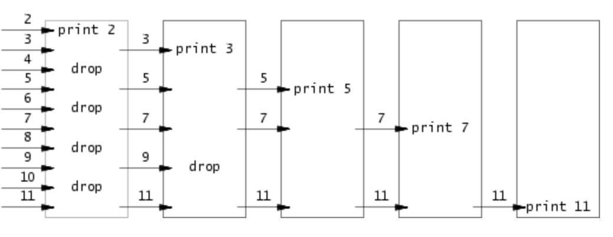

# lab1 util 实验报告

## 1. sleep（easy）

```实验要求(英文)```：

Implement the UNIX program sleep for xv6; your sleep should pause for a user-specified number of ticks. A tick is a notion of time defined by the xv6 kernel, namely the time between two interrupts from the timer chip. Your solution should be in the file user/sleep.c.

Some hints:

+ Before you start coding, read Chapter 1 of the xv6 book.
+ Look at some of the other programs in `user/ (e.g., user/echo.c, user/grep.c, and user/rm.c)` to see how you can obtain the command-line arguments passed to a program.
+ If the user forgets to pass an argument, sleep should print an error message.
+ The command-line argument is passed as a string; you can convert it to an integer using `atoi` (see user/ulib.c).
Use the system call sleep.
+ See `kernel/sysproc.c` for the xv6 kernel code that implements the `sleep` system call (look for `sys_sleep`), `user/user.h` for the C definition of sleep callable from a user program, and user/usys.S for the assembler code that jumps from user code into the kernel for sleep.
+ Make sure main calls `exit()` in order to exit your program.
+ Add your sleep program to `UPROGS` in Makefile; once you've done that, make qemu will compile your program and you'll be able to run it from the xv6 shell.
+ Look at Kernighan and Ritchie's book The C programming language (second edition) (K&R) to learn about C.

```实验要求(中文)```：

为xv6实现UNIX程序sleep；您的sleep应该暂停用户指定的一定数量的ticks。ticks是由xv6内核定义的时间概念，即来自计时器芯片的两个中断之间的时间。您的解决方案应该在文件 *user/sleep.c* 中。

一些提示：

+ 在开始编码之前，请阅读xv6书的第1章。
+ 查看`user/`目录中的其他程序（例如`user/echo.c`、`user/grep.c`和`user/rm.c`），以了解如何获取传递给程序的命令行参数。
+ 如果用户忘记传递参数，则sleep应该打印错误消息。
+ 命令行参数以字符串形式传递；您可以使用`atoi`将其转换为整数（请参见`user/ulib.c`）。
使用系统调用sleep。
+ 请参阅`kernel/sysproc.c`，了解实现`sleep`系统调用的xv6内核代码（查找`sys_sleep`），`user/user.h`用于从用户程序调用的sleep的C定义，以及user/usys.S用于从用户代码跳转到内核以进行sleep的汇编代码。
+ 确保main调用`exit()`以退出程序。
+ 将您的sleep程序添加到Makefile的`UPROGS`中；完成后，make qemu将编译您的程序，您将能够从xv6 shell中运行它。
+ 查看Kernighan和Ritchie的书《C程序设计语言》（第二版）（K＆R），以了解C语言。

这个实验非常简单，只需要在sleep.c中完成主程序调用sleep即可，sleep函数的参数是一个整数，代表睡眠的时间，单位是tick，所以我们只需要将传入的字符串转换成整数即可，这里使用了atoi函数，然后调用sleep函数即可。

在user/sleep.c中完成如下主程序编写
```c
#include<kernel/types.h>
#include<user/user.h>

int main(int argc,char** argv)
{
    if(argc!=2)
    {
        printf("Error Example:sleep 2\n");
        exit(-1);
    }

    //sleep系统调用函数在在user.h中被定义，但深层是通过汇编语言绑定到sys_sleep函数上的
    int num_of_tick = atoi(argv[1]);
    if(sleep(num_of_tick)<0)
    {
        printf("Can not sleep\n");
        exit(-1);
    }
    exit(0);
}
```

这个实验关键是要理解os如何通过shell来执行系统自带可以直接被命令行使用的系统调用。是通过添加可执行程序sleep，可执行程序中在主程序中再进一步调用os提供的系统调用函数

## 2. pingpong（easy）

```实验要求(英文)```：

Write a program that uses UNIX system calls to ''ping-pong'' a byte between two processes over a pair of pipes, one for each direction. The parent should send a byte to the child; the child should print "<pid>: received ping", where <pid> is its process ID, write the byte on the pipe to the parent, and exit; the parent should read the byte from the child, print "<pid>: received pong", and exit. Your solution should be in the file user/pingpong.c.

Some hints:

+ Use pipe to create a pipe.
+ Use fork to create a child.
+ Use read to read from the pipe, and write to write to the pipe.
+ Use getpid to find the process ID of the calling process.
+ Add the program to UPROGS in Makefile.
+ User programs on xv6 have a limited set of library functions available to them. You can see the list in user/user.h; the source (other than for system calls) is in user/ulib.c, user/printf.c, and user/umalloc.c.

Run the program from the xv6 shell and it should produce the following output:
```shell
    $ make qemu
    ...
    init: starting sh
    $ pingpong
    4: received ping
    3: received pong
    $
```

```实验要求(中文)```：

编写一个程序，使用UNIX系统调用在一对pipe上“乒乓”一个字节，每个方向一个管道。父进程应该向子进程发送一个字节；子进程应该打印“：received ping”，其中是其进程ID，在管道上将字节写入父进程，并退出；父进程应该从子进程读取字节，打印“：received pong”，然后退出。您的解决方案应该在文件*user/pingpong.c*中。

一些提示：

+ 使用 *pipe* 创建一个管道。
+ 使用 *fork* 创建一个子进程。
+ 使用 *read* 从管道中读取数据，使用write向管道中写入数据。
+ 使用 *getpid* 查找调用进程的进程ID。
+ 将程序添加到Makefile的 *UPROGS* 中。
+ xv6上的用户程序只能使用有限的库函数。您可以在user/user.h中查看列表；源代码（除了系统调用之外）在user/ulib.c、user/printf.c和user/umalloc.c中。

```实验答案:```

这个实验的关键是理解pipe的使用，pipe是一种特殊的文件，它有两个文件描述符，一个用于读，一个用于写，这两个文件描述符可以在不同的进程中使用，这样就可以实现进程间通信。

pipe[0] 表示读端，pipe[1]表示写端，pipe[0]和pipe[1]都是文件描述符，可以使用read和write函数进行读写。

在user/pingpong.c中完成如下主程序编写
```c
int main(int argc, char** argv)
{
    int pTos[2];
    int sTop[2];
    int p_pid;
    int pid;
    int n;

    pipe(pTos);
    pipe(sTop);

    p_pid = getpid();
    if( (pid= fork())<0 )
    {
        printf("fork failed\n");
        exit(-1);
    }
    if(pid== 0)//此处为子进程
    {
        close(pTos[1]);
        close(sTop[0]);
        char c = 'a';
        if((n=write(sTop[1], &c, 1))<0)
        {
            printf("write failed\n");
            exit(-1);
        }
        c = '\0';
        if ((n = read(pTos[0], &c, 1)) < 0)
        {
            printf("read error");
            exit(-1);
        }
        int spid=getpid();
        if (n > 0 && c!='\0')
            printf("<%d>:received ping\n", spid);
        exit(0);
    }
    //此处为父进程
    close(pTos[0]);
    close(sTop[1]);
    char c = 'a';
    if((n=write(pTos[1], &c, 1))<0)
    {
        printf("write failed\n");
        exit(-1);
    }
    //父进程发送完消息之后就需要陷入等待状态
    wait(0);
    c = '\0';//父进程的打印要在子进程的打印之后结束，否则就会导致打印出来的东西乱七八糟（因为时间片轮转算法）
    if ((n = read(sTop[0], &c, 1)) < 0)
    {
        printf("read error");
        exit(-1);
    }
    if (n > 0 && c!='\0')
        printf("<%d>:received pong\n", p_pid);
    exit(0);
}
```

## 3. primes（medium）

```实验要求(英文)```：

Write a concurrent version of prime sieve using pipes. This idea is due to Doug McIlroy, inventor of Unix pipes. The picture halfway down this page and the surrounding text explain how to do it. Your solution should be in the file user/primes.c.

Your goal is to use pipe and fork to set up the pipeline. The first process feeds the numbers 2 through 35 into the pipeline. For each prime number, you will arrange to create one process that reads from its left neighbor over a pipe and writes to its right neighbor over another pipe. Since xv6 has limited number of file descriptors and processes, the first process can stop at 35.

Some hints:

+ Be careful to close file descriptors that a process doesn't need, because otherwise your program will run xv6 out of resources before the first process reaches 35.
+ Once the first process reaches 35, it should wait until the entire pipeline terminates, including all children, grandchildren, &c. Thus the main primes process should only exit after all the output has been printed, and after all the other primes processes have exited.
+ Hint: read returns zero when the write-side of a pipe is closed.
+ It's simplest to directly write 32-bit (4-byte) ints to the pipes, rather than using formatted ASCII I/O.
+ You should create the processes in the pipeline only as they are needed.
+ Add the program to UPROGS in Makefile.

Your solution is correct if it implements a pipe-based sieve and produces the following output:

    $ make qemu
    ...
    init: starting sh
    $ primes
    prime 2
    prime 3
    prime 5
    prime 7
    prime 11
    prime 13
    prime 17
    prime 19
    prime 23
    prime 29
    prime 31
    $

```实验要求(中文)```：

使用管道编写并发版本的素数筛。这个想法来自于Unix管道的发明者Doug McIlroy。
这个[链接](https://swtch.com/~rsc/thread/)中间的图片和周围的文本解释了如何做。

您的解决方案应该在user/primes.c文件中。

你的目标是使用管道和fork来建立管道。第一个进程将2到35的数字输入到管道中。对于每个质数，你将安排创建一个进程，该进程从其左邻居通过管道读取，并通过另一个管道写入其右邻居。由于xv6具有有限的文件描述符和进程数量，因此第一个进程可以停止在35。

一些提示：
+ 注意关闭进程不需要的文件描述符，否则你的程序会在第一个进程达到35之前就耗尽了xv6的资源。
+ 一旦第一个进程达到35，它就应该等待整个管道终止，包括所有的子进程、孙子进程等。因此，主素数进程只有在所有输出被打印后，所有其他素数进程退出后才能退出。
+ 提示：当管道的写端被关闭时，read返回零。
+ 最简单的方法是直接将32位（4字节）int写入管道，而不是使用格式化的ASCII I/O。
+ 你应该只在需要的时候才创建管道中的进程。
+ 将程序添加到Makefile中的UPROGS中。

这个实验首先要理解取素数的方法，每获得一个数，就将它和所有进程中的数字尝试做除法，若都除不尽则说明这个数是素数，那么为这个数新建立一个进程，并且与上一个进程建立管道连接

下图很好的说明了这个过程



在user/primes.c中完成如下主程序编写
```c
#include "kernel/types.h"
#include "user/user.h"

void primes(int *);

int main(int argc, char**argv)
{   
    //正确的做法还得是递归比较合理
    int i;
    int p2s_org[2];
    pipe(p2s_org);

    int pid;

    pid=fork();

    if(pid==0){//子进程
        close(p2s_org[1]);//不会写回
        primes(p2s_org);
    }
    else{//父进程
        close(p2s_org[0]);
        for(i=2;i<32;i++){
            write(p2s_org[1],&i,1);
        }
        i=0;//0是关闭信号，当发送0的时候就告诉子进程该收手了
        write(p2s_org[1],&i,1);
        wait(0);
        exit(0);
    }
    return 0;
}

//不得不用递归的原因在于，每个进程要保留上一个进程输入的接口的同时还要创建自己给下一个进程的输出接口，为了逻辑明确，只能用递归

void primes(int *inp){
  //  printf("primes\n");
  int c;
  read(inp[0],&c,1);
  //值得注意的是，子进程在收到父进程传递的第一个质数之前，会被阻塞在此处
  if(c==0){
      //c=0是关闭信号，当进程收到c=0的时候就告诉子进程该收手了
      close(inp[0]);
      exit(0);
  }
  printf("prime %d \n",c);
  int fnum=c;
  //每个新进程第一个收到的数都是质数，也即进程本身要存储的代表自身的数字

  int p_next[2];
  pipe(p_next);
  
  int pid=fork();
  if(pid==0){
      close(p_next[1]);
      primes(p_next);
  }
  else{
      close(p_next[0]);
      while (1)
      {
        //进程会不断的接受和发送数据，直到收到0为止
          read(inp[0],&c,1);
          if(c%fnum!=0){
              write(p_next[1],&c,1);
          }
          if(c==0){
              write(p_next[1],&c,1);
              close(p_next[1]);
              wait(0);//等待子进程结束
              exit(0);
          }
      }
  }
}
```

## 4.find
  
```实验要求(英文)```：

Write a simple version of the UNIX find program: find all the files in a directory tree with a specific name. Your solution should be in the file user/find.c.

Some hints:

+ Look at user/ls.c to see how to read directories.
+ Use recursion to allow find to descend into sub-directories.
+ Don't recurse into "." and "..".
+ Changes to the file system persist across runs of qemu; to get a clean file system run make clean and then make qemu.
+ You'll need to use C strings. Have a look at K&R (the C book), for example Section 5.5.
+ Note that == does not compare strings like in Python. Use strcmp() instead.
+ Add the program to UPROGS in Makefile.

Your solution is correct if produces the following output (when the file system contains the files b and a/b):

    $ make qemu
    ...
    init: starting sh
    $ echo > b
    $ mkdir a
    $ echo > a/b
    $ find . b
    ./b
    ./a/b
    $ 
  
```实验要求(中文)：```

编写一个简单版本的UNIX find程序：查找目录树中具有特定名称的所有文件。您的解决方案应该在user/find.c文件中。

一些提示：
+ 查看user/ls.c以查看如何读取目录。
+ 使用递归允许find进入子目录。
+ 不要递归到“.”和“..”中。
+ 文件系统的更改在qemu运行期间持续存在；要获得干净的文件系统，请运行make clean，然后运行make qemu。
+ 您需要使用C字符串。例如，查看K＆R（C书）的第5.5节。
+ 请注意，==不会像Python中那样比较字符串。请改用strcmp()
+ 将程序添加到Makefile中的UPROGS中。

该实验涉及到读取路径以及，以及路径下的文件，ls是一个很有参考价值的指令，可以先学习ls中的方法
基本步骤是
先利用open读取路径，获取fd
利用fstat获取文件信息，若文件是目录，取出文件目录下所有的文件名，攒成path，进一步递归调用find，若文件是普通文件，则判断文件名是否相同，若相同则输出路径

以下内容在user/find.c中
```c
#include "kernel/types.h"
#include "kernel/stat.h"
#include "user/user.h"
#include "kernel/fs.h"

char *fmtname(char *);

void find(char* path,char*filename)
{
    char buf[512], *p;
    int fd;
    struct dirent de;
    struct stat st;
    char bufname[512];

    if((fd = open(path, 0)) < 0){
      fprintf(2, "find: cannot open %s\n", path);
      return;
    }

    if(fstat(fd, &st) < 0){
      fprintf(2, "find: cannot stat %s\n", path);
      close(fd);
      return;
    }
    switch(st.type){
        case T_DIR://如果这个path是一个文件夹
            //列出该文件夹下的所有内容，对所有的文件名不是filename的执行新一轮的find
            if(strlen(path) + 1 + DIRSIZ + 1 > sizeof buf){
                printf("find: path too long\n");
                break;
            }
            strcpy(buf, path);
            p = buf+strlen(buf);
            *p++ = '/';
            while(read(fd, &de, sizeof(de)) == sizeof(de)){
                if(de.inum == 0)
                    continue;
                memmove(p, de.name, DIRSIZ);
                p[DIRSIZ] = 0;
                if(stat(buf, &st) < 0){
                    printf("find: cannot stat %s\n", buf);
                    continue;
                }
                strcpy(bufname,fmtname(buf));
                printf("the file in dir %s\n", bufname);
                //printf("buf: %s\n", buf);
                printf("bufname cmp: %d\n",strcmp(bufname, "."));
                if (strcmp(bufname, ".") == 0 || strcmp(bufname, "..") == 0)
                    continue;
                //printf("is it .?");
                if (strcmp(bufname, filename) == 0)
                {
                    printf("%s/%s\n",path,filename);
                }
                else{
                    find(buf, filename);
                }
            }
            break;
        default:
            break;
    }
    close(fd);
    return;
}

char*
fmtname(char *path)
{
  static char buf[DIRSIZ+1];
  char *p;

  // Find first character after last slash.
  for(p=path+strlen(path); p >= path && *p != '/'; p--)
    ;
  p++;

  // Return blank-padded name.
  if(strlen(p) >= DIRSIZ)
    return p;
  memmove(buf, p, strlen(p));
  buf[strlen(p)] = '\0';
  return buf;
}

int main(int argc, char** argv)
{
    if(argc<3){
        printf("argc error 'find' needs 2 parameters");
        exit(-1);
    }

    //argv[1]是需要去查询的目录
    //argv[2]是需要找到的文件名

    //可以用递归去查找
    if(strcmp(argv[1], ".")==0)
        find(".", argv[2]);
    exit(0);
}
```

## 5.xv6中的系统调用

```实验要求(英文)```：

Write a simple version of the UNIX xargs program: read lines from the standard input and run a command for each line, supplying the line as arguments to the command. Your solution should be in the file user/xargs.c.

The following example illustrates xarg's behavior:
    $ echo hello too | xargs echo bye
    bye hello too
    $
  
Note that the command here is "echo bye" and the additional arguments are "hello too", making the command "echo bye hello too", which outputs "bye hello too".
Please note that xargs on UNIX makes an optimization where it will feed more than argument to the command at a time. We don't expect you to make this optimization. To make xargs on UNIX behave the way we want it to for this lab, please run it with the -n option set to 1. For instance

    $ echo "1\n2" | xargs -n 1 echo line
    line 1
    line 2
    $
  
Some hints:

+ Use `fork` and `exec` to invoke the command on each line of input. Use wait in the parent to wait for the child to complete the command.
+ To read individual lines of input, read a character at a time until a newline ('\n') appears.
+ kernel/param.h declares MAXARG, which may be useful if you need to declare an argv array.
+ Add the program to UPROGS in Makefile.
+ Changes to the file system persist across runs of qemu; to get a clean file system run make clean and then make qemu.

xargs, find, and grep combine well:
```sh
  $ find . b | xargs grep hello
```
will run "grep hello" on each file named b in the directories below ".".
To test your solution for xargs, run the shell script xargstest.sh. Your solution is correct if it produces the following output:
```sh
  $ make qemu
  ...
  init: starting sh
  $ sh < xargstest.sh
  $ $ $ $ $ $ hello
  hello
  hello
  $ $   
```
You may have to go back and fix bugs in your find program. The output has many $ because the xv6 shell doesn't realize it is processing commands from a file instead of from the console, and prints a $ for each command in the file.

```实验要求(中文)```：

写一个简单版本的UNIX xargs程序：从标准输入读取行，并为每行运行一个命令，将该行作为参数提供给命令。您的解决方案应该在文件user/xargs.c中。

以下示例说明了xarg的行为：
```sh
    $ echo hello too | xargs echo bye
    bye hello too
    $
```

 一些提示：

+ 使用`fork`和`exec`在每行输入上调用命令。 使用父节点中的等待等待子节点完成命令。
+ 要读取单个输入行，请一次读取一个字符，直到出现换行符（'\ n'）。
+ kernel / param.h声明MAXARG，如果需要声明argv数组，则可能很有用。
+ 将程序添加到Makefile中的UPROGS。
+ 对文件系统的更改会跨越qemu运行; 要获得干净的文件系统，请运行make clean，然后运行make qemu。

对于xargs使用的通俗理解:
```
cmd1 arg1 | xargs cmd2 arg2
```

xargs会将cmd1的输出作为cmd2的参数，即`cmd2 arg2 argout`
argout 即cmd1的输出

该系统调用的实现依赖于fork和exec，对于cmd1，我们fork子程序后将他的prinf重定向到管道的写端，然后再执行exec。父进程等待cmd1执行结束后，也就收集完了他的输出（其实是xargs这个指令的进程的读端被重定向到了管道上），然后将他的输出内容和cmd2 的参数结合，然后再执行exec

其中管道的功能由 `|` 实现,管道具体在user/sh.c中实现了,所以只需要执行xargs的时候把输出的东西用起来即可

```实验代码：```

```c
#include "kernel/types.h"
#include "user/user.h"

int main(int argc, char **argv)
{
    //要执行的指令的是argv[1]
    char inputBuf[512];
    char *cmdArgv[32];//执行命令的参数
    char argvBuf[512];
    int argvBufSize;
    char *argvbufp;
    int i = 0;
    int argvi = 0;
    int n;
    int pid;

    for (argvi = 0; argvi < argc-1; argvi++)
    {
        cmdArgv[argvi] = argv[argvi + 1];
    }

    argvBufSize = 0;
    argvbufp = argvBuf;
    while ((n=read(0,inputBuf,512))>0)
    {
        for (i = 0; i < n;i++)
        {
            char curChar = inputBuf[i];
            if (curChar == ' ')
            {
                argvBuf[argvBufSize++] = '\0';
                cmdArgv[argvi] = argvbufp;
                argvi++;
                argvbufp = &argvBuf[argvBufSize];
            }
            else if(curChar=='\n' || curChar=='\r')
            {
                argvBuf[argvBufSize] = '\0';
                cmdArgv[argvi] = argvbufp;
                
                if((pid=fork())<0)
                {
                    printf("Failed to fork\n");
                    exit(-1);
                }
                else if(pid==0)//子进程
                {
                    exec(argv[1], cmdArgv);
                }
                wait(0);
                //父进程继续执行
                argvBufSize = 0;
                argvi = argc - 1;
                argvbufp = argvBuf;
            }
            else
            {
                argvBuf[argvBufSize++] = curChar;
            }
        }
    }
    exit(0);
}
```

# 笔记

## 2.vscode利用gdb来debug
首先要配置好launch.json
```json
{
    "version": "0.2.0",
      // configuration 包含了 gdb 启动的相关信息
    "configurations": [
        {
            "name": "debug xv6",
          // 如果没有下载c/pp插件 这个type会报错
            "type": "cppdbg",
            "request": "launch",
          // 你需要的调试的二进制文件 , 默认是kernel/kernel ,因为你先得把xv6启动 你才有机会调试xv6上的用户程序
            "program": "${workspaceFolder}/kernel/kernel",
            "args": [],
          // 是否在kernel的main函数中 打个断点
            "stopAtEntry": true,
            "cwd": "${workspaceFolder}",
          // make qemu-gdb 会启动一个 gdbserver ,你需要指定一个端口,来连接上这个gdb server, 具体端口可以查看.gdbinit
            "miDebuggerServerAddress": "localhost:25501",
          // gdb的路径,  gdb可以是gdb-multiarch 也可以是riscv64-linux-gnu-gdb 具体看你安装的是哪个, 如果是ubuntu的话 
          // 应该是gdb-multiarch 比较多
            "miDebuggerPath": "/opt/riscv-gnu-toolchain/bin/riscv64-unknown-elf-gdb",
            "environment": [],
            "externalConsole": false,
            "MIMode": "gdb",
            "setupCommands": [
                {
                    "description": "pretty printing",
                    "text": "-enable-pretty-printing",
                    "ignoreFailures": true
                }
            ],
            "logging": {
                "engineLogging":true,
                "programOutput": true,
            },
        }
    ]
}
```
记得注释掉gdbinit中的第三行（表示的远程连接的行）
```
remote target 127.0.0.1:25501
```
---
开始调试的步骤
+ 在shell输入 ``` make qemu-gdb ```
+ 在vscode界面启动，可以直接按F5，也可以用ui界面的debug

kernel与user两个文件夹中的程序debug要点
+ kernel的断点可以随便打
+ 对于user空间的bug，需要先在``` debug console``` 界面执行以下指令
```shell
-exec file user/_{用户程序名字}
```
举例如下
```shell
#为find打断点前的提前工作
-exec file user/_find
```
---
## 3.usys.pl代码的含义
这段 Perl 代码定义了一个名为 entry 的函数，其功能是根据传入的 $name 参数生成汇编程序的入口代码。

具体来说：

+ my $name = shift; 获取入口函数的名称参数。
+ print ".global $name\n"; 输出 .global 指令，声明该函数为全局可见的。
+ print "${name}:\n"; 输出标签，标识程序的入口位置。
+ print " li a7, SYS_${name}\n"; 将 SYS_ 前缀和函数名称拼接起来，得到对应的系统调用编号，并将该编号存储在 MIPS 的 a7 寄存器中。
+ print " ecall\n"; 执行 MIPS 的 ecall 指令，触发系统调用。
+ print " ret\n"; 返回函数，将控制权交还给调用者。
因此，该 Perl 代码的作用是简化 MIPS 汇编程序的编写，通过调用 entry 函数，可以快速生成常用的系统调用函数的入口代码。

---

## 4.li指令的含义
li是 MIPS 汇编语言中的一个伪指令（Pseudo-Instruction），其全称为 Load Immediate ，作用是将一个立即数加载到寄存器中。其语法形式如下：

li $rd, immediate
其中，$rd 表示目标寄存器（destination register），immediate 表示要加载进寄存器中的立即数。该指令实际上是一个伪指令，其执行效果相当于两个单独的指令，即 lui 和 ori。

具体来说，li 命令将一个 16 位的立即数作为参数，将其高 16 位加载到目标寄存器中，然后再将立即数的低 16 位通过 OR 操作合并到目标寄存器的低 16 位中。由于 MIPS 的指令格式中，只有 16 位用于存储立即数，因此 li 指令提供了一种方便的方式，使得程序员可以使用更大的立即数，而不用自行分割为两个 16 位的数

---

## 5.ecall的含义
ecall（Environment CALL）是 MIPS 指令集中的一个特殊指令，用于触发系统调用，即向进程管理器请求操作系统服务。在 MIPS 指令集中，所有系统调用均由 ecall 指令触发，该指令的操作码为 0x0000000C。

当执行 ecall 指令时，MIPS 处理器根据寄存器 a7 中存储的系统调用号来调用相应的系统调用处理程序，通常会传递其它的参数，例如系统调用的参数，结果的存放位置等。系统调用的处理程序可以执行相应的系统操作，例如打开文件、读写数据、创建进程等。在系统调用处理程序执行结束后，控制权返回到下一条指令。

因此，ecall 指令是 MIPS 指令集中的一个十分重要的指令，实现了用户进程执行内核代码的功能。它使得用户进程能够通过系统调用请求操作系统提供的服务，例如进行文件操作、进程创建等功能，从而实现了用户进程与操作系统的交互和通信。

---
## 6. 系统调用——从用户态到内核态的参数的传递

这是内核态的 ``` sys_sleep ``` 的函数内容
```c
uint64
sys_sleep(void)
{
  int n;
  uint ticks0;

  argint(0, &n);//在这一步尝试获取参数
  acquire(&tickslock);
  ticks0 = ticks;
  while(ticks - ticks0 < n){
    if(killed(myproc())){
      release(&tickslock);
      return -1;
    }
    sleep(&ticks, &tickslock);
  }
  release(&tickslock);
  return 0;
}
```

这一步随后又深入调用argraw，来获取参数，n取0的意思是获取中断栈中的第一个参数
```c
void
argint(int n, int *ip)
{
  *ip = argraw(n);
}
```

argraw是真正抓取参数的函数
```c
static uint64
argraw(int n)
{
  struct proc *p = myproc();
  switch (n) {
  case 0:
    return p->trapframe->a0;
    //在中断向量表的第一个位置获得参数（因为只有一个参数）
  case 1:
    return p->trapframe->a1;
  case 2:
    return p->trapframe->a2;
  case 3:
    return p->trapframe->a3;
  case 4:
    return p->trapframe->a4;
  case 5:
    return p->trapframe->a5;
  }
  panic("argraw");
  return -1;
}
```
所以系统调用是从当前用户进程的中断表中获取参数

---