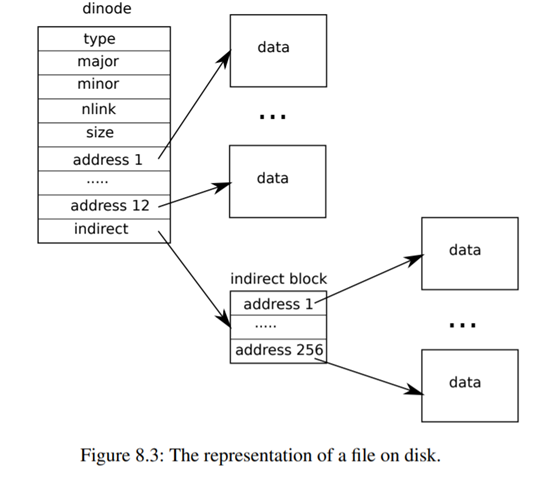

# lab9 file system实验报告

## 1.Large files (moderate)

### **1.1 实验要求（英文）：**
In this assignment you'll increase the maximum size of an xv6 file. Currently xv6 files are limited to 268 blocks, or 268*BSIZE bytes (BSIZE is 1024 in xv6). This limit comes from the fact that an xv6 inode contains 12 "direct" block numbers and one "singly-indirect" block number, which refers to a block that holds up to 256 more block numbers, for a total of 12+256=268 blocks.

The bigfile command creates the longest file it can, and reports that size:
```
$ bigfile
..
wrote 268 blocks
bigfile: file is too small
$
```
The test fails because bigfile expects to be able to create a file with 65803 blocks, but unmodified xv6 limits files to 268 blocks.
You'll change the xv6 file system code to support a "doubly-indirect" block in each inode, containing 256 addresses of singly-indirect blocks, each of which can contain up to 256 addresses of data blocks. The result will be that a file will be able to consist of up to 65803 blocks, or 256*256+256+11 blocks (11 instead of 12, because we will sacrifice one of the direct block numbers for the double-indirect block).

Preliminaries
The mkfs program creates the xv6 file system disk image and determines how many total blocks the file system has; this size is controlled by FSSIZE in kernel/param.h. You'll see that FSSIZE in the repository for this lab is set to 200,000 blocks. You should see the following output from mkfs/mkfs in the make output:
nmeta 70 (boot, super, log blocks 30 inode blocks 13, bitmap blocks 25) blocks 199930 total 200000
This line describes the file system that mkfs/mkfs built: it has 70 meta-data blocks (blocks used to describe the file system) and 199,930 data blocks, totaling 200,000 blocks.
If at any point during the lab you find yourself having to rebuild the file system from scratch, you can run make clean which forces make to rebuild fs.img.
What to Look At
The format of an on-disk inode is defined by struct dinode in fs.h. You're particularly interested in NDIRECT, NINDIRECT, MAXFILE, and the addrs[] element of struct dinode. Look at Figure 8.3 in the xv6 text for a diagram of the standard xv6 inode.
The code that finds a file's data on disk is in bmap() in fs.c. Have a look at it and make sure you understand what it's doing. bmap() is called both when reading and writing a file. When writing, bmap() allocates new blocks as needed to hold file content, as well as allocating an indirect block if needed to hold block addresses.

bmap() deals with two kinds of block numbers. The bn argument is a "logical block number" -- a block number within the file, relative to the start of the file. The block numbers in ip->addrs[], and the argument to bread(), are disk block numbers. You can view bmap() as mapping a file's logical block numbers into disk block numbers.

Your Job
Modify bmap() so that it implements a doubly-indirect block, in addition to direct blocks and a singly-indirect block. You'll have to have only 11 direct blocks, rather than 12, to make room for your new doubly-indirect block; you're not allowed to change the size of an on-disk inode. The first 11 elements of ip->addrs[] should be direct blocks; the 12th should be a singly-indirect block (just like the current one); the 13th should be your new doubly-indirect block. You are done with this exercise when bigfile writes 65803 blocks and usertests runs successfully:
```
$ bigfile
..................................................................................................................................................................................................................................................................................................................................................................................................................................................................................................................................................................................................................................................................................
wrote 65803 blocks
done; ok
$ usertests
...
ALL TESTS PASSED
$ 
```
bigfile will take at least a minute and a half to run.

Hints:

+ Make sure you understand bmap(). Write out a diagram of the relationships between ip->addrs[], the indirect block, the doubly-indirect block and the singly-indirect blocks it points to, and data blocks. Make sure you understand why adding a doubly-indirect block increases the maximum file size by 256*256 blocks (really -1, since you have to decrease the number of direct blocks by one).
+ Think about how you'll index the doubly-indirect block, and the indirect blocks it points to, with the logical block number.
+ If you change the definition of NDIRECT, you'll probably have to change the declaration of addrs[] in struct inode in file.h. Make sure that struct inode and struct dinode have the same number of elements in their addrs[] arrays.
+ If you change the definition of NDIRECT, make sure to create a new fs.img, since mkfs uses NDIRECT to build the file system.
+ If your file system gets into a bad state, perhaps by crashing, delete fs.img (do this from Unix, not xv6). make will build a new clean file system image for you.
+ Don't forget to brelse() each block that you bread().
+ You should allocate indirect blocks and doubly-indirect blocks only as needed, like the original bmap().
+ Make sure itrunc frees all blocks of a file, including double-indirect blocks.

### **1.2 实验要求（中文）：**
这个作业中你将增加xv6文件的最大大小。目前xv6文件限制为268块，或268 * BSIZE字节（在xv6中BSIZE为1024）。这个限制来自于xv6 inode包含12个“直接”块号和一个“单间接”块号，它指的是一个块，其最多包含256个块号，总计12 + 256 = 268块。

bigfile命令创建它可以的最长文件，并报告该大小：
$ bigfile
..
wrote 268 blocks
bigfile: file is too small
$
测试失败是因为bigfile期望能够创建一个有65803个块的文件，但是标准的xv6只支持文件有268个块。你需要修改xv6文件系统的代码，使之支持每个inode有一个二级索引块，包含256个一级索引块的地址，每个一级索引块可以包含256个数据块的地址。结果就是一个文件最多可以包含65803个块，或者256*256+256+11个块（11个而不是12个，因为我们将牺牲一个直接块的编号来存储二级索引块）

准备工作
mkfs程序创建xv6文件系统磁盘映像，并且决定文件系统有多少块；这个大小由kernel/param.h中的FSSIZE定义。你将会看到FSSIZE在这个lab的repo中被设置为200,000。你应该在make的输出中看到mkfs/mkfs的如下输出：
nmeta 70 (boot, super, log blocks 30 inode blocks 13, bitmap blocks 25) blocks 199930 total 200000
这一行描述了mkfs/mkfs创建的文件系统：它有70个元数据块（用来描述文件系统的块）和199,930个数据块，总计200,000个块。
如果在lab的任何时候你发现自己必须从头开始重建文件系统，你可以运行make clean，它会强制make重新构建fs.img。

你需要看的代码
磁盘上inode的格式由fs.h中的struct dinode定义。你特别需要看NDIRECT，NINDIRECT，MAXFILE，以及struct dinode中的addrs[]元素。看一下xv6文档中8.3节的图表，来了解标准的xv6 inode的结构。



在fs.c中，找到文件在磁盘上的数据的代码是bmap()。看一下它，确保你理解它在做什么。bmap()在读写文件的时候都会被调用。在写文件时，bmap()会根据需要分配新的块来保存文件内容，也会根据需要分配一个一级索引块来保存块的地址。

bmap()处理两种块号。bn参数是“逻辑块号”——文件中的块号，相对于文件的开始。ip->addrs[]中的块号，以及传递给bread()的参数，是磁盘块号。你可以把bmap()看作是把文件的逻辑块号映射到磁盘块号。

你的任务

在bmap()中增加一个间接块，除了直接块和一个单间接块。你必须只有11个直接块，而不是12，为你的新的双间接块腾出空间；你不允许改变一个在磁盘上的inode的大小。ip->addrs[]的前11个元素应该是直接块；第12个应该是一个单间接块（就像当前的那个）；第13个应该是你的新的双间接块。当bigfile写入65803个块并且usertests成功运行时，你就完成了这个练习：

```
$ bigfile
..................................................................................................................................................................................................................................................................................................................................................................................................................................................................................................................................................................................................................................................................................
wrote 65803 blocks
done; ok
$ usertests
...
ALL TESTS PASSED
$ 
```

bigfile至少需要一分半钟来运行。

一些提示:

+ 理解bmap()。画出ip->addrs[]、间接块、双重间接块和它指向的一次间接块和数据块之间的关系图。确保你理解为什么添加双重间接块可以将最大文件大小增加256*256块（实际上是-1，因为你必须将直接块的数量减少1）。
+ 思考一下你将如何用逻辑块号索引双重间接块和它指向的一次间接块。
+ 如果你改变了NDIRECT的定义，你可能必须改变file.h中struct inode中addrs[]的声明。确保struct inode和struct dinode的addrs[]数组中具有相同的元素数量。
+ 如果你改变了NDIRECT的定义，一定要创建一个新的fs.img，因为mkfs使用NDIRECT来构建文件系统。
+ 如果你的文件系统进入了一个坏状态，比如崩溃，删除fs.img（从Unix而不是xv6中执行）。make将为您构建一个新的干净的文件系统映像。
+ 别忘了brelse()每个块，你吃面包。
+ 你应该分配间接块和双重间接块只是在需要的时候，就像原来的bmap()。
+ 确保itrunc释放文件的所有块，包括双重间接块。

### **1.3 实验思路与代码：**

这个实验主要要处理过程，我们可以参考read(),write()一个文件的流程，看block是如何通过off分配与查找的，不难看出关键就是就是bmap()函数

`fs.c`
```c
int
readi(struct inode *ip, int user_dst, uint64 dst, uint off, uint n)
{
  ...
  for(tot=0; tot<n; tot+=m, off+=m, dst+=m){
    bp = bread(ip->dev, bmap(ip, off/BSIZE));
    m = min(n - tot, BSIZE - off%BSIZE);
    ...
  }
  return tot;
}

int
writei(struct inode *ip, int user_src, uint64 src, uint off, uint n)
{
  ...
  for(tot=0; tot<n; tot+=m, off+=m, src+=m){
    bp = bread(ip->dev, bmap(ip, off/BSIZE));
    m = min(n - tot, BSIZE - off%BSIZE);
    if(either_copyin(bp->data + (off % BSIZE), user_src, src, m) == -1) {
      brelse(bp);
      break;
    }
    log_write(bp);
    brelse(bp);
  }
  ...
}

```

仔细阅读bmap函数
`fs.c`
```c
static uint
bmap(struct inode *ip, uint bn)
{
  uint addr, *a;
  struct buf *bp;

  if(bn < NDIRECT){
    if((addr = ip->addrs[bn]) == 0)
      ip->addrs[bn] = addr = balloc(ip->dev);
    return addr;
  }
  bn -= NDIRECT;

  if(bn < NINDIRECT){
    // Load indirect block, allocating if necessary.
    if((addr = ip->addrs[NDIRECT]) == 0)
      ip->addrs[NDIRECT] = addr = balloc(ip->dev);
    bp = bread(ip->dev, addr);
    a = (uint*)bp->data;
    if((addr = a[bn]) == 0){
      a[bn] = addr = balloc(ip->dev);
      log_write(bp);
    }
    brelse(bp);
    return addr;
  }

  panic("bmap: out of range");
}
```

bmap就是通过阅读addr的数组，来找到对应的块，在原始版本中一个inode中有长度为13的数组，前12个（0～11）为直接映射关系，第13个（12）为一阶间接映射，即他所指向的block中存储的全是block号，那么1k大小的block可以存256个block号，拿这些block号就能找到存储数据的block

改进后的bmap前11个（0～10）为直接映射，第12个（11）为一阶间接映射，第13个为二阶间接映射，此处需要讲NDIRECT改为11，再定义一个256*256的二阶映射的大小EXT_NINDIRECT，文件块的最大值应该为NDIRECT + NINDIRECT+EXT_NINDIRECT

`fs.h`
```c
#define NDIRECT 11
#define NINDIRECT (BSIZE / sizeof(uint))
#define EXT_NINDIRECT NINDIRECT*NINDIRECT
#define MAXFILE (NDIRECT + NINDIRECT+EXT_NINDIRECT)

struct dinode {
  ...
  uint addrs[NDIRECT+2];   // Data block addresses
};
```

`fs.c`
```c
static uint
bmap(struct inode *ip, uint bn)
{
  uint addr, *a1,*a2;
  struct buf *bp1,*bp2;
  uint ud_index;
  uint index;

  if(bn < NDIRECT){
    if((addr = ip->addrs[bn]) == 0)
      ip->addrs[bn] = addr = balloc(ip->dev);
    return addr;
  }
  bn -= NDIRECT;

  //此处是一阶间接索引
  if(bn < NINDIRECT){
    // Load indirect block, allocating if necessary.
    if((addr = ip->addrs[NDIRECT]) == 0)
      ip->addrs[NDIRECT] = addr = balloc(ip->dev);
    bp1 = bread(ip->dev, addr);
    a1 = (uint*)bp1->data;
    if((addr = a1[bn]) == 0){
      a1[bn] = addr = balloc(ip->dev);
      log_write(bp1);
    }
    brelse(bp1);
    return addr;
  }
  bn-=NINDIRECT;
  //此处是二阶间接索引
  if(bn < EXT_NINDIRECT){
    // Load indirect block, allocating if necessary.
    if((addr = ip->addrs[NDIRECT+1]) == 0)
      ip->addrs[NDIRECT+1] = addr = balloc(ip->dev);

    ud_index=bn/NINDIRECT;
    index=bn%NINDIRECT;
    
    //一阶索引
    bp1 = bread(ip->dev, addr);
    a1 = (uint*)bp1->data;

    if((addr = a1[ud_index]) == 0){
      a1[ud_index] = addr = balloc(ip->dev);
      log_write(bp1);
    }

    //二阶索引
    bp2=bread(ip->dev,addr);
    a2=(uint*)bp2->data;
    
    if((addr=a2[index])==0){
      a2[index]=addr=balloc(ip->dev);
      log_write(bp2);
    }

    //
    brelse(bp1);
    brelse(bp2);
    return addr;
  }

  panic("bmap: out of range");
}
```

## 2.*Symbolic links* (moderate)

### **2.1 实验要求（英文）：**
In this exercise you will add *symbolic links* to xv6. *Symbolic links* (or soft links) refer to a linked file by pathname; when a symbolic link is opened, the kernel follows the link to the referred file. *Symbolic links* resembles hard links, but hard links are restricted to pointing to file on the same disk, while *symbolic links* can cross disk devices. Although xv6 doesn't support multiple devices, implementing this system call is a good exercise to understand how pathname lookup works.

Your job
You will implement the symlink(char *target, char *path) system call, which creates a new symbolic link at path that refers to file named by target. For further information, see the man page symlink. To test, add symlinktest to the Makefile and run it. Your solution is complete when the tests produce the following output (including usertests succeeding).
```
$ symlinktest
Start: test symlinks
test symlinks: ok
Start: test concurrent symlinks
test concurrent symlinks: ok
$ usertests
...
ALL TESTS PASSED
$ 
```
Hints:

+ First, create a new system call number for symlink, add an entry to user/usys.pl, user/user.h, and implement an empty sys_symlink in kernel/sysfile.c.
+ Add a new file type (T_SYMLINK) to kernel/stat.h to represent a symbolic link.
+ Add a new flag to kernel/fcntl.h, (O_NOFOLLOW), that can be used with the open system call. Note that flags passed to open are combined using a bitwise OR operator, so your new flag should not overlap with any existing flags. This will let you compile user/symlinktest.c once you add it to the Makefile.
+ Implement the symlink(target, path) system call to create a new symbolic link at path that refers to target. Note that target does not need to exist for the system call to succeed. You will need to choose somewhere to store the target path of a symbolic link, for example, in the inode's data blocks. symlink should return an integer representing success (0) or failure (-1) similar to link and unlink.
+ Modify the open system call to handle the case where the path refers to a symbolic link. If the file does not exist, open must fail. When a process specifies O_NOFOLLOW in the flags to open, open should open the symlink (and not follow the symbolic link).
+ If the linked file is also a symbolic link, you must recursively follow it until a non-link file is reached. If the links form a cycle, you must return an error code. You may approximate this by returning an error code if the depth of links reaches some threshold (e.g., 10).
+ Other system calls (e.g., link and unlink) must not follow *symbolic links*; these system calls operate on the symbolic link itself.
+ You do not have to handle *symbolic links* to directories for this lab.

### **2.2 实验要求（中文）：**

在这个练习中，您将向 xv6 添加symbolic links。symbolic links（或soft links）通过路径名引用链接的文件；当打开 symbolic link 时，内核将跟随链接到所引用的文件。symbolic link 类似于硬链接，但是硬链接仅限于指向相同磁盘上的文件，而symbolic link可以跨越磁盘设备。尽管 xv6不支持多个设备，但实现此系统调用是一个很好的练习，可以了解路径名查找的工作原理。

你的工作
您将实现symlink（char * target，char * path）系统调用，该系统调用在路径处创建一个新的symbolic link，该symbolic link指向目标命名的文件。有关详细信息，请参阅symlink man页面。要进行测试，请将symlinktest添加到Makefile并运行它。您的解决方案完成后，测试将生成以下输出（包括usertests成功）。

```sh
$ symlinktest
Start: test symlinks
test symlinks: ok
Start: test concurrent symlinks
test concurrent symlinks: ok
$ usertests
...
ALL TESTS PASSED
$ 
```

一些提示：

+ 首先，为symlink创建一个新的系统调用号，将条目添加到user/usys.pl、user/user.h，并在kernel/sysfile.c中实现一个空的sys_symlink。
+ 将一个新的文件类型（T_SYMLINK）添加到kernel/stat.h中，以表示符号链接。
+ 在kernel/fcntl.h中添加一个新的标志（O_NOFOLLOW），可以与open系统调用一起使用。注意，传递给open的标志使用按位OR运算符组合，因此你的新标志不应与任何现有标志重叠。这将允许你将user/symlinktest.c添加到Makefile中一次。
+ 实现symlink(target, path)系统调用，创建一个新的符号链接，指向target。注意，target不需要存在也能成功执行系统调用。你需要选择一个位置来存储符号链接的目标路径，例如inode的数据块。symlink应该返回一个整数，表示成功（0）或失败（-1），类似于link和unlink。
+ 修改open系统调用，以处理path引用符号链接的情况。如果文件不存在，open必须失败。当进程在flags中指定O_NOFOLLOW时，open应该打开符号链接（而不是跟随符号链接）。
+ 如果链接的文件也是一个符号链接，则必须递归地跟随它，直到达到一个非链接文件。如果链接形成一个循环，必须返回一个错误代码。你可以通过在链接深度达到某个阈值（例如，10）时返回一个错误代码来近似实现。
+ 其他系统调用（例如，link和unlink）不能跟随符号链接；这些系统调用操作符号链接本身。
+ 对于这个实验，你不必处理对目录的符号链接。

### **2.3 实验思路与代码：**

本实验理解意图后也不难，大体过程就是
调用该函数后在path上创建一个文件，文件的type是新定义的SYMLINK，在文件中存储原文件的路径字符串即可。
```c
symlink(char *target, char *path) 
```
当open type为SYMLINK时，打开文件后，读取文件中的路径字符串，再次调用open函数打开该路径即可。本实验要求了递归深度，所以需要在open函数中加入一个递归深度的参数，每次递归时深度加一，当深度大于10时返回错误。

首先还是创建symlink的系统调用基本方法（创建系统调用的过程不再赘述，请自行按照syscall的历程去加）

创建symlink函数主要包括，根据path查找是否已经存在这样的文件，如果存在则直接打开，如果不存在则创建一个新的文件，创建新文件参考open，只是type为SYMLINK，然后
将target的路径写入文件中。  

fcntl.h
```c
#define O_NOFOLLOW 0x800
```

`kernel/stat.h`
```c
#define T_SYMLINK 4
```
`kernel/sysfile.c`
```c
uint64
sys_symlink(void){
  struct inode *lkip;

  char tgpath[MAXPATH];
  char lkpath[MAXPATH];
  int tgn,lkn;
  int r,n1;
  int off=0;

  if((tgn = argstr(0, tgpath, MAXPATH)) < 0 || (lkn = argstr(1, lkpath, MAXPATH)) < 0){
    printf("break point1");
    return -1;
  }
    
  
  begin_op();

  //要检查是否已经存在lkpath的文件
  lkip = namei(lkpath);
  if(lkip==0){
    lkip = create(lkpath, T_FILE, 0, 0);
  }
  else{
    ilock(lkip);
  }
  if (lkip == 0)
  {
    end_op();
    printf("break point2");
    return -1;
  }

  lkip->type=T_SYMLINK;
  //将target的link写入lkip的inode中
  while (off<tgn)
  {
    n1=tgn-off;
    if((r=writei(lkip,0,(uint64)tgpath,off,n1)) > 0)
      off+=r;
    if(r!=n1)
      break;
  }
  lkip->size=tgn;

  //此处使用iunlockput是因为申请完之后并不打算打开这个ip，也没有open，所以要iunlockput
  iunlockput(lkip);
  end_op();

  //返回结果正确与否
  if(off!=tgn){
    printf("bk 3");
    return -1;
  }
    
  return 0;
}
```

然后需要处理当open的是symlink类型的文件时(并且open不能是NOFOLLOW模式)，则深入解析symlink即可
```c
uint64
sys_open(void)
{
  ...
  if(ip->type == T_DEVICE && (ip->major < 0 || ip->major >= NDEV)){
    iunlockput(ip);
    end_op();
    return -1;
  }
  int sym_state;
  // 此处ip被偷天换日了，所以说要解决问题
  if(ip->type==T_SYMLINK && ((omode & O_NOFOLLOW) ==0)){
    if((sym_state=open_symlink(&ip))<0){
      //iunlockput(ip);
      end_op();
      return -1;
    }
  }
  ...
}

//该实验最大的坑就是进行深入解析额inode时候要记得将之前的SYMLINK类型的ip给释放掉，否则会造成内存泄漏
int
open_symlink(struct inode** lkip){
  int depth=0;
  char path[MAXPATH];
  int r;
  int n;
  struct inode* ip=*lkip;
  while (ip->type==T_SYMLINK)
  {
    n=ip->size;
    if(depth==10){
      return -1;
    }
    if((r=readi(ip,0,(uint64)path,0,n))<0)
      return -1;
    if(r!=n)
      return -1;
    iunlockput(ip);//此处需要深入去取inode了，原本的inode也无需保留，所以要用unlockput，否则inode会被占用完
    ip = namei(path);
    if (ip == 0){
      *lkip = ip;
      return -1;
    }
    ilock(ip);
    depth++;
  }
  *lkip=ip;
  return 0;
}
```